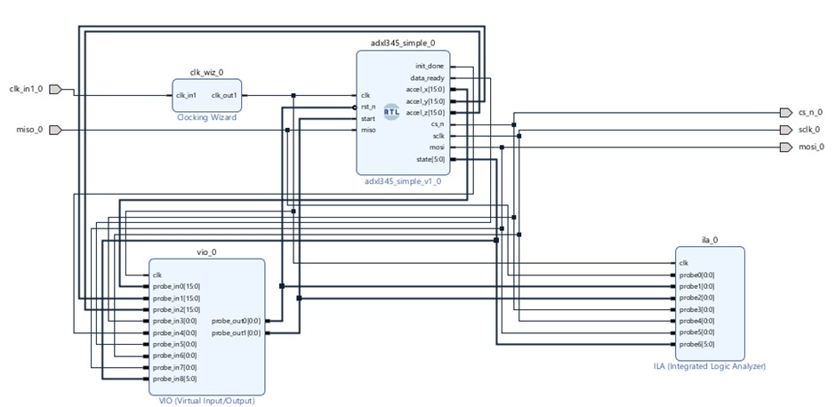
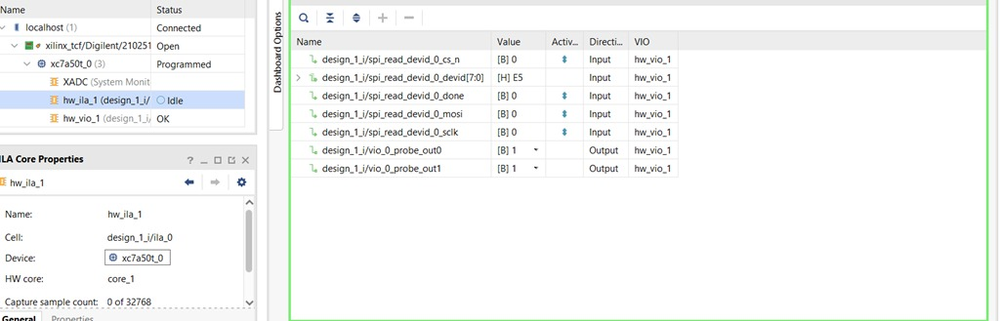
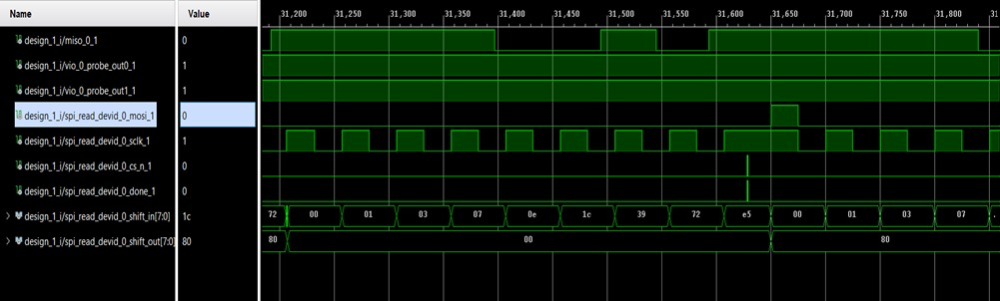
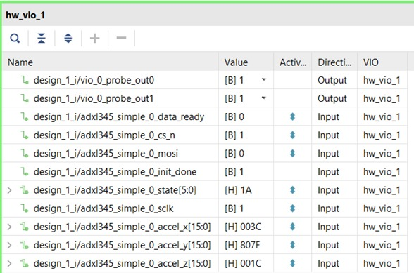

# ADXL345 SPI Interface using Artix-7 FPGA

This repository presents an FPGA-based implementation of a **4-wire SPI interface** to communicate with the **ADXL345 three-axis accelerometer** using an **Artix-7 FPGA**. The project verifies SPI communication by reading the device ID and then acquires real-time X, Y, and Z acceleration data. Functional verification is carried out using **ILA** and **VIO**.

---

## 📌 Project Objectives

- Implement a custom SPI master in Verilog  
- Interface the ADXL345 accelerometer with an Artix-7 FPGA  
- Verify communication by reading the Device ID register (`0xE5`)  
- Acquire real-time X, Y, Z acceleration data  
- Validate timing and functionality using ILA and VIO  

---

## ⚙️ Hardware & Tools Used

- Artix-7 FPGA Development Board  
- ADXL345 Accelerometer Module  
- Vivado Design Suite  
- Verilog HDL  
- Integrated Logic Analyzer (ILA)  
- Virtual Input/Output (VIO)  

---

##  Block Diagram

The following block diagram illustrates the overall system architecture, showing the SPI master implemented on the FPGA and its interaction with the ADXL345 accelerometer.

---

##  Device ID Verification

To verify SPI communication, the **DEVID register (address 0x00)** of the ADXL345 was read. The returned value was **0xE5**, which matches the value specified in the datasheet, confirming correct SPI timing, wiring, and protocol implementation.

---

##  ILA Waveform Analysis

The Integrated Logic Analyzer (ILA) was used to monitor SPI signals including **CS, SCLK, MOSI, and MISO**. The waveform confirms correct clock polarity and phase, proper chip select behavior, and accurate data sampling.

---

##  Acceleration Output (X, Y, Z)

Real-time acceleration data from the X, Y, and Z axes was observed using the VIO dashboard. The values change dynamically with sensor orientation, and when stationary, one axis measures approximately ±1 g while the others remain close to zero, validating correct accelerometer operation.

---

## Timing and Resource Analysis

- All user-defined timing constraints are met  
- Positive setup and hold slack observed  
- No timing violations reported  
- Efficient FPGA resource utilization  

---

## Conclusion

The project successfully demonstrates reliable SPI communication between an Artix-7 FPGA and the ADXL345 accelerometer. Correct device identification, accurate three-axis acceleration measurements, clean timing closure, and real hardware validation confirm the robustness of the design. This implementation provides a solid foundation for future motion-sensing and FPGA-based embedded applications.

---

## 🚀 Future Scope

- Interrupt-based acceleration data acquisition  
- FIFO burst-mode SPI reads  
- Tilt and orientation angle computation  
- Sensor data filtering and fusion  
- Multi-sensor expansion  

---

## 👩‍💻 Author

**Ramiksha C. Shetty**  
Electronics and Communication Engineering  
FPGA | Digital Design | VLSI
